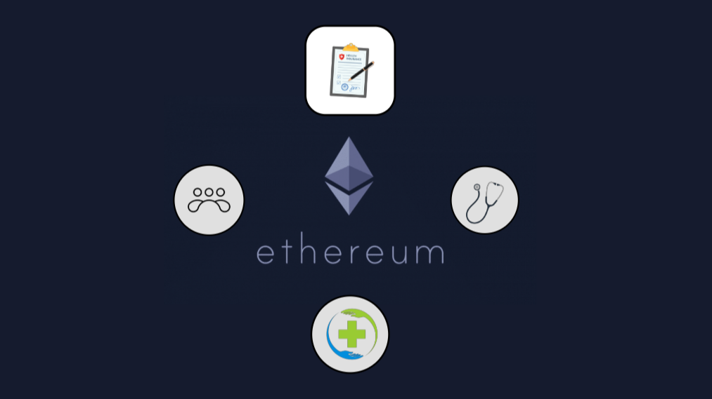

# Socialchain - Solidity

### Video Demostracion

## Descripción:
La finalidad de el proyecto se centra en desarrollar un sistema basado en la tecnología de blockchain para que los médicos de un consultorio puedan facturar sus prestaciones. La premisa fundamental es la recopilación y almacenamiento de datos e información de manera que un tercero (financiador, hospital,  privado),  pueda verificar su validez sin riesgo de alteraciones.

<h2> Dudas y resoluciones 🤔</h3>

<h3> ¿A qué se refiere este proceso? </h3>

El proceso de facturación de prestaciones médicas implica registrar, valorar y liquidar los servicios médicos brindados a pacientes hospitalarios o ambulatorios. Su objetivo es cobrar a los financiadores del sistema de salud, quienes a su vez, deben revisar dichas liquidaciones para realizar los pagos correspondientes.

<h3>¿Qué problema queremos resolver?</h3>

El proceso de facturación de prestaciones médicas presenta varios desafíos: desconfianza entre prestadores y financiadores, sobrefacturación y subfacturación,  pérdida de documentos de respaldo para lograr pagos,  costos administrativos elevados, procesos manuales tediosos, plazos extensos entre prestación y cobro.

En la actualidad las empresas del sector salud enfrentan  crisis dada la notoria dificultad financiera, en la cual incide en gran parte, la cantidad de actores que intervienen en el proceso transaccional de facturación, cobro y pago, donde además, se generan problemas en el cobro y seguimiento de las facturas, perdidas de transacciones y cobros inexistentes, entre otros problemas.

<h3>¿Por qué aplicaríamos cadena de bloques?
</h3>

La tecnología de cadena de bloques crea un "libro mayor compartido e inmutable" que permite rastrear los distintos momentos de una transaccion. Evita entradas no autorizadas y permite a los participantes ver y compartir las transacciones.

Características clave de la tecnología de cadena de bloques para este proceso:

1. Descentralización: Transfiere el control a una red distribuida, reduciendo la necesidad de confianza y evitando el control centralizado.
2. Inmutabilidad: Garantiza que las transacciones registradas no se pueden cambiar; cualquier error requiere una nueva transacción que se registra y es visible para la red.
3. Consenso: Establece reglas para que las transacciones se registren solo con el consentimiento de la mayoría de los participantes de la red.

<h3>¿Qué lograríamos con una cadena de bloques?
</h3>

1. Mejorar del flujo del proceso: ágiliza el ciclo de facturación y mejorar el flujo de efectivo.
2. Reducción de errores: Automatización en la facturación para minimizar errores.
3. Transparencia y confianza: Registro inalterable en blockchain para eliminar disputas y aumentar la confianza.
4. Simplificación de procesos: Eliminación de sobrecarga administrativa y auditorías manuales.

<h2> Funcionalidades basicas 🚀
</h2>

1. Crear registro y asistencia del paciente (Medico)
2. Aprobaciond del registro (Paciente)
3. Aprobacion del registro y verificacion final (Obra Social)

## Tecnologías utilizadas 🖥
- Lenguaje de programación: Javascript y Solidity
- SmartContract: Solidity
- Frontend: HTML, CSS, JavaScript

## Equipo de desarrollo y agradecimientos 👩‍💻
- Idea, propuesta del proyecto y presentacion: Maria del Carmen
- Desarrolladora front-end: Carolina Herrera
- Desarrollador SmartContract: Tomás Saint-Romain

<table align="center">
  <tr>
    <td align="center">
      <a href="https://www.linkedin.com/in/carolina-herrera-108350189?utm_source=share&utm_campaign=share_via&utm_content=profile&utm_medium=android_app" title="Carolina Herrera perfil linkedin">
         
        
          <b>Carolina Herrera</b>
        
      </a>
    </td>
    <td align="center">
      <a href="https://www.linkedin.com/in/mariacponce?utm_source=share&utm_campaign=share_via&utm_content=profile&utm_medium=android_app" title="Maria del Carmen perfil linkedin">
         
        
          <b>Maria del Carmen</b>
        
      </a>
    </td>
  </tr>
</table>

## Fechas del proyecto 🕒

**Inicio: 26/08/2023**

**Finalización: 13/12/2023**

**Duracion total: 109 Dias (3 meses y medio)**
